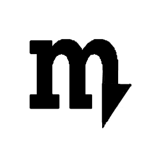

# mdVditor Readme

[简体中文](README.cn.md)

mdVditor is a desktop Markdown note application developed based on the Neutralinojs framework. It combines front-end technologies like JavaScript/TypeScript with the native desktop capabilities provided by Neutralinojs to deliver a smooth and efficient Markdown editing experience.

**Key Features:**

* **Instant Rendering:** Employs the Vditor Markdown editor, achieving instant rendering upon input, providing a WYSIWYG (What You See Is What You Get) experience without the need to manually switch previews.
* **Rich Markdown Syntax Support:** Vditor supports standard Markdown syntax and offers various extended syntaxes, such as:
  * **GFM** (GitHub Flavored Markdown)
  * **Mathematical Formulas:** Supports both KaTeX and MathJax rendering engines for mathematical formulas.
  * **Flowcharts, Sequence Diagrams, Gantt Charts:** Uses mermaid syntax for drawing flowcharts.
  * **Mind Maps:** Uses markmap syntax for drawing mind maps.
  * **Charts:** Supports the ECharts charting library.
  * **Music Notation:** Supports ABC.js for rendering musical notation.
* **Desktop Application Experience:** Built on Neutralinojs, it provides the performance and experience of a native desktop application, with a small footprint and fast startup speed.
* **Cross-Platform Support:** Neutralinojs supports cross-platform building, allowing mdVditor to run on operating systems like Windows, macOS, and Linux.

**Usage:**

1. **Download and Install:** Download the installation package corresponding to your operating system from the release page and install it.
2. **Launch mdVditor:** Run the application.
3. **Edit Markdown:** Enter Markdown text in the editor area, and the rendered result will be displayed instantly.
4. **Save/Open:** Use the provided save and open functions to manage your notes.

**mdVditor Development Notes**

mdVditor is built using the Neutralinojs framework with Vditor.js as the front-end Markdown editor.

**Technology Stack:**

* **Front-end:** HTML, CSS, JavaScript/TypeScript, [Vditor](https://github.com/Vanessa219/vditor)
* **Framework:**[Neutralinojs](https://neutralino.js.org/)
* **Build Tool:** (Depending on project requirements, Neutralinojs projects typically use its built-in CLI tool)

**Development Environment Setup:**

1. **Install bun or npm/yarn/pnpm:** Or install Node.js and a package manager.
2. **Install Neutralinojs CLI:**`bun install -g @neutralinojs/cli` or `yarn global add @neutralinojs/cli` or `pnpm add -g @neutralinojs/cli`
3. **Clone the Repository:**
   **Bash**

   ```
   git clone https://github.com/stxh/mdVditor.git # Assuming you're still using the same repository
   cd mdVditor
   ```
4. **Initialize Neutralinojs Project (if needed):** If starting from scratch, you can use `neu create my-app` to create a project.
   **Note:** This project requires a `neutralinojs` version with `server.setVDocRoot`. Please use [this PR](https://github.com/neutralinojs/neutralinojs/pull/1365).
5. **Install Front-end Dependencies:**
   **Bash**

   ```
   cd frontend
   bun install # or npm install or yarn install or pnpm install
   ```
6. **Run the Development Server:**
   **Bash**

   ```
   neu run
   ```

**Code Structure:**

(The following is an example, adjust according to the actual project structure)

```
mdVditor/
├── neutralino.config.json      // Neutralinojs configuration file
├── resources/                  // Front-end code
│   ├── index.html
│   ├── src/                   // JavaScript/TypeScript source code
│   │   ├── main.js           // or main.ts
│   │   └── components/       // Components
│   │       └── ...
│   ├── package.json
│   └── ...
├── main.js                   // Neutralinojs main process entry point (optional)
└── ...
```

**Key Code Snippets:**

* **Front-end Vditor Integration:**
  **JavaScript**

  ```
  import Vditor from 'vditor'

  const vditor = new Vditor('vditor', {
      // Vditor configuration options, for example:
      mode: 'ir', // Instant rendering mode
      height: '100%',
      // ...other configurations
  })
  ```
* **Neutralinojs API Usage:** (For example, file operations)
  **JavaScript**

  ```
  Neutralino.filesystem.readFile('./my-file.md', (err, data) => {
      if (err) {
          console.error(err);
      } else {
          console.log(data);
      }
  });
  ```

**Contributing Code, Building, and Other Notes**

Similar to other open-source projects, you can contribute code by forking the repository, creating branches, and submitting Pull Requests.

Building the application requires the Neutralinojs CLI:

**Bash**

```
neu build
```

This will generate binary files for the corresponding platforms.

**Key Changes and Notes:**

* The framework has been changed to Neutralinojs.
* The front-end module uses Vditor.js.
* Build and run commands use the `neu` CLI.
* The Go back-end is no longer used.

This updated documentation more accurately describes the mdVditor application built using Neutralinojs and Vditor.js. Please adjust it according to your actual project code.
